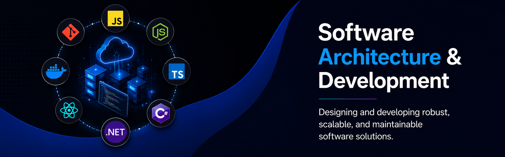
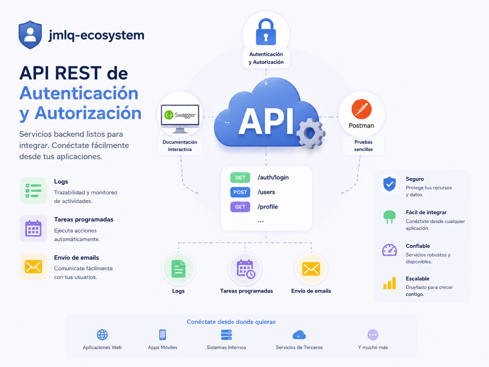
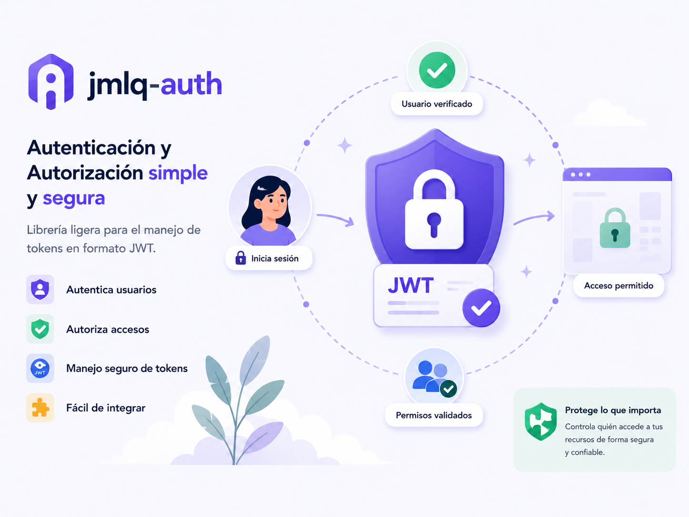
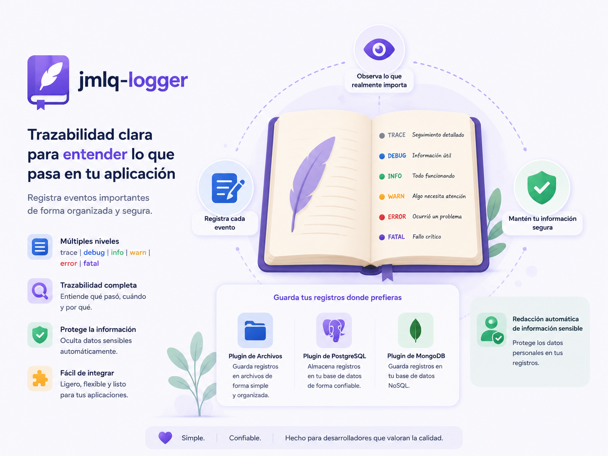
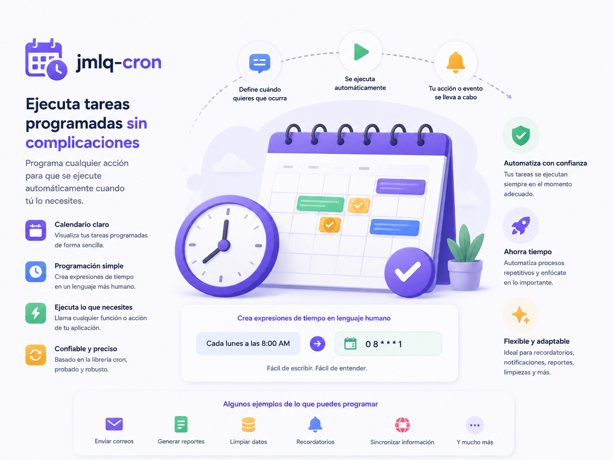

---

# 👨‍💻 Sobre mí

### Arquitectura • Backend • Escalabilidad • Observabilidad

Ingeniero de software con sólida experiencia en arquitectura de software y desarrollo backend utilizando C#/.NET y Node.js.

Experiencia en diseño de APIs REST, integración de servicios, automatización de procesos y modernización de sistemas para entornos corporativos y soluciones de alta exigencia técnica.

Desarrollo soluciones orientadas a claridad de código, trazabilidad, observabilidad y confiabilidad operativa, priorizando separación de responsabilidades, evolución continua y mantenibilidad del software.

---

# 🏗️ Arquitectura y Buenas Prácticas

- 🧱 Clean Architecture
- 🎯 Domain-Driven Design (DDD)
- ⬡ Arquitectura Hexagonal
- 📐 Principios SOLID
- 🧩 Diseño modular
- 🔄 CQRS
- 🔀 Separación de responsabilidades
- ♻️ Bajo acoplamiento y alta cohesión
- 🛠️ Código mantenible y escalable

---

# 🚀 Proyectos Destacados

<table>
<tr>

<td width="50%" valign="top">

## 🔐 jmlq-ecosystem

  

  

  

Módulo RESTful de autenticación y autorización construido sobre una arquitectura modular y desacoplada utilizando paquetes reutilizables `@jmlq/*`.

`JWT • RBAC • Clean Architecture • Docker • CI/CD`

</td>

<td width="50%" valign="top">

## 🔑 jmlq-auth

  

  

Librería de autenticación y autorización para Node.js diseñada con principios de Clean Architecture y JWT.

`Authentication • Sessions • Refresh Tokens • JWT`

</td>

</tr>

<tr>

<td width="50%" valign="top">

## 📊 jmlq-logger

  

  

Librería de logging enfocada en trazabilidad, observabilidad y monitoreo para aplicaciones Node.js.

`Structured Logs • MongoDB • PostgreSQL • Filesystem`

</td>

<td width="50%" valign="top">

## ⏰ jmlq-cron

  

  

Librería para ejecución de tareas programadas y automatización basada en cron para Node.js.

`Cron Jobs • Scheduler • Automation • Modular API`

</td>

</tr>

<tr>

<td width="50%" valign="top">

## 📧 jmlq-mailer

  

  

Librería para envío de correos y notificaciones utilizando Nodemailer con soporte para plantillas y adjuntos.

`Email Templates • Notifications • Attachments • Nodemailer`

</td>

</tr>
</table>

---

# 🛠️ Tecnologías y Herramientas

## Backend

  
  

  
  
  

## Frontend

  

## Infraestructura y Herramientas

  

  
  
  
  

## Bases de Datos

  
  
  
  
  

---

# 🌎 Contacto

  

  

